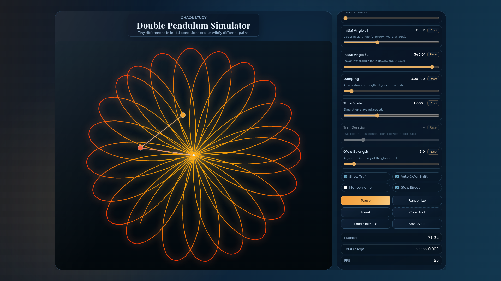

<h1 align="center">Chaos Double Pendulum Simulator</h1>

🌐 Live Demo: 
https://NEO1842.github.io/Chaos-Double-Pendulum-Simulator/

Turn chaos into art.

## 🚀 Overview

Chaos Double Pendulum Simulator is a physics-based simulation of a double pendulum system.

This system demonstrates chaotic motion, where small differences in initial conditions lead to completely different outcomes.

## ✨ Features
- 📸 Save trajectory as image
- 🖼 1080p high-quality export
- ⌨️ Shortcut key support
- 🎨 Clean trajectory-only capture
- ⚡ Real-time simulation

## 🚀 Usage

### ▶ Try Online (Recommended)
👉 https://NEO1842.github.io/Chaos-Double-Pendulum-Simulator/

### 📦 Download
1. Go to Releases
2. Download the latest version (v1.0.0)
3. Open `index.html` in your browser

## 🧠 About

This simulation is based on a double pendulum system, a classic example of a nonlinear dynamical system.

Even tiny differences in initial conditions produce completely different motion.

## 📂 Project Structure
- `/physics/`: Physics engine and dynamics
- `/ui/`: UI and controls
- `/hue/`: Color and visual effects

# Technical Details

This simulation is based on the physical laws of a double pendulum system, a typical example of a nonlinear dynamical system.

## Status
- 🚀 v1.0.0 Official Release
- 🔧 Next update planned (August 2026)
- ✨ New features currently in development

---

<h1 align="center">Chaos Double Pendulum Simulator</h1>

🌐 デモはこちら: 
https://NEO1842.github.io/Chaos-Double-Pendulum-Simulator/

カオスをアートに。

## 🚀 概要

このシミュレーターは、二重振り子の物理システムを再現したものです。

初期条件のわずかな違いが、まったく異なる動きを生み出す「カオス現象」を体験できます。

## ✨ 主な機能
- 📸 軌道を画像として保存
- 🖼 1080pの高画質出力
- ⌨️ ショートカットキー対応
- 🎨 UIなしの軌道のみキャプチャ
- ⚡ リアルタイムシミュレーション

## 🚀 使い方

### ▶ ブラウザで試す（おすすめ）
👉 https://NEO1842.github.io/Chaos-Double-Pendulum-Simulator/

### 📦 ダウンロード
1. Releasesページへ移動
2. 最新版（v1.0.0）をダウンロード
3. `index.html` を開く

## 🧠 技術概要

このシミュレーションは、非線形力学系の代表例である二重振り子に基づいています。

わずかな違いが大きな変化を生むカオス的な挙動を観察できます。

## 📂 構成
- `/physics/`: 物理演算
- `/ui/`: UI・操作
- `/hue/`: 色とエフェクト

## 技術的な詳細 

このシミュレーションは、非線形力学系の典型的な例である二重振り子システムの物理法則に基づいています。

## ステータス
- 🚀 v1.0.0 正式リリース
- 🔧 次回アップデート予定（2026年8月）
- ✨ 新機能を開発中
